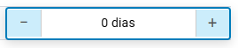
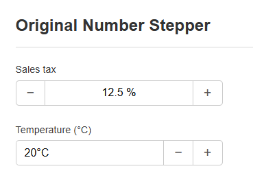
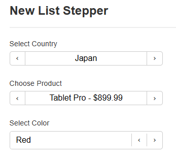
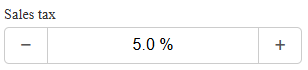

# HPV Number Stepper

A zero-dependency JavaScript library for building interactive number and list steppers with customizable layouts, HTML rendering, dynamic editing, and callbacks.

## Key Features Overview

- Always-on HTML rendering for display with optional dynamic text input on click (when `editable: true`)
- Content selection control via `allowContentSelection` to prevent text highlighting on display
- Custom `renderValue` for formatted output and `renderInputValue` for editable input text extraction
- List steppers with wrap-around, substring search, and object-based selection
- Zero dependencies, memory-safe with `destroy()` method


## Screenshots







## Features

- 🚀 **Zero dependencies** - Pure vanilla JavaScript implementation
- 🎨 **Customizable layout** - Arrange minus/plus buttons and display/input in any order via `layout` array
- 🔢 **Advanced rendering** - Always renders as HTML via `renderValue` callback; supports rich content like emojis, flags, and styled elements
- ✏️ **Dynamic editing** - Click display to show editable text input (when `editable: true`); supports Enter/Blur commit and Escape cancel
- 🔍 **Content control** - `allowContentSelection: false` prevents text selection on display for control-like behavior
- ⌨️ **Full keyboard support** - Arrow keys for stepping, Enter for confirm, Escape for cancel in edit mode
- 🎯 **Event callbacks** - `onCreate`, `onChange`, `onRender` for integration
- 📱 **Responsive and accessible** - Mobile-friendly with ARIA attributes and keyboard navigation
- 🧹 **Memory safe** - Comprehensive cleanup in `destroy()` method
- 🔄 **List-specific** - Wrap-around cycling, substring search in edit mode, programmatic item updates

## Installation

### Direct Download

Download the built files from the `dist/` directory and include them in your HTML:

```html
<link rel="stylesheet" href="path/to/dist/css/all.css">
<script src="path/to/dist/js/all.min.js"></script>
```

### npm (Coming Soon)

```bash
npm install hpv-number-stepper
```

## Quick Start

Include the built CSS and JS, then create and mount a stepper:

```html
<!DOCTYPE html>
<html>
<head>
    <link rel="stylesheet" href="dist/css/all.css">
</head>
<body>
    <div id="stepper-container"></div>
    
    <script src="dist/js/all.min.js"></script>
    <script>
        const container = document.getElementById('stepper-container');
        const stepper = new HpvNumberStepper({
            initialValue: 5,
            min: 0,
            max: 100,
            stepSize: 1,
            renderValue: (val) => `${val}%`, // Custom HTML rendering
            layout: ['minus', 'display', 'plus']
        });
        
        stepper.mountTo(container);
        
        // Optional: Listen for changes
        stepper.onChange = (val) => console.log('Value:', val);
    </script>
</body>
</html>
```

## Configuration Options (HpvNumberStepper)

Common options for both steppers, with number-specific noted:

| Option | Type | Default | Description |
|--------|------|---------|-------------|
| `initialValue` | Number | `0` | Starting value/index for the stepper |
| `min` | Number | `0` | Minimum allowed value |
| `max` | Number | `100` | Maximum allowed value |
| `stepSize` | Number | `1` | Amount to increment/decrement (index step for lists) |
| `layout` | Array<string> | `['minus', 'display', 'plus']` | Order of elements: 'minus', 'plus', 'display' |
| `onCreate` | Function | `undefined` | Callback `(value, instance) => {}` on creation |
| `onChange` | Function | `undefined` | Callback `(value, instance) => {}` on change |
| `renderValue` | Function | `(val) => `${val}`` | Returns HTML string for display: `(value, instance) => {}` |
| `editable` | Boolean | `false` | Enables click-to-edit dynamic input on display |
| `allowContentSelection` | Boolean | `true` | Allows text selection on display (false adds 'no-select' class) |
| `renderInputValue` | Function | Default extraction | Returns plain text for dynamic input: `(value, instance) => {}` |

Note: Display always uses HTML rendering via `innerHTML`. Dynamic input appears on click if `editable: true`, with parsing on commit (parseFloat for numbers).

## Examples

### Basic Usage

```javascript
const stepper = new HpvNumberStepper({
    initialValue: 10,
    min: 0,
    max: 50,
    stepSize: 5
});
```

## List Stepper

The `HpvListStepper` extends the base for cycling through an array of items (objects with `id` and `label` by default). It supports wrap-around, substring search in edit mode, and rich HTML rendering. Shares all common options, with additions below.

### Usage

```javascript
const countries = [
    { id: 'us', label: 'United States' },
    { id: 'ca', label: 'Canada' },
    { id: 'mx', label: 'Mexico' },
    { id: 'br', label: 'Brazil' }
];

const stepper = new HpvListStepper({
    items: countries,
    initialItem: 'br', // ID string or full object
    keyField: 'id',
    valueField: 'label',
    renderValue: (item, index) => item.label, // HTML string for display
    renderInputValue: (item) => item.label, // Plain text for input
    onChange: (item, index) => console.log(`Selected: ${item.label} at index ${index}`),
    editable: true, // Enable dynamic edit
    layout: ['minus', 'display', 'plus'],
    allowContentSelection: false // Prevent selection on HTML display
});

stepper.mountTo(document.getElementById('country-stepper'));
```

### List-Specific Options

| Option | Type | Default | Description |
|--------|------|---------|-------------|
| `items` | Array<object> | `[]` | Array of items (e.g., `{ id: string, label: string }`) |
| `initialItem` | string\|object | `items[0]` | Starting item by ID or full object |
| `keyField` | string | `'id'` | Property for unique identification |
| `valueField` | string | `'label'` | Property for display and search matching |
| `renderValue` | Function | `item[valueField]` | `(item, index, instance) => {}` returns HTML for display |
| `onChange` | Function | `undefined` | `(item, index, instance) => {}` on selection change |
| `renderInputValue` | Function | HTML strip to text | `(item, index, instance) => {}` plain text for edit input |

Notes:
- Wrap-around: Reaching end cycles to start.
- Edit mode: Type to search substring in `valueField` (case-insensitive).
- Buttons: Chevrons ('‹', '›') for lists.
- `getValue()` returns index; `getValue(true)` returns rendered HTML.

### List-Specific API Methods

- `getSelectedItem()`: Returns current full item object.
- `setSelectedItem(item)`: Sets by full item object (searches by `keyField`).
- `updateItems(newItems)`: Replaces items array, preserves selection if possible.


### Custom Layout Example

```javascript
const stepper = new HpvNumberStepper({
    initialValue: 0,
    layout: ['plus', 'display', 'minus'] // Custom order
});
```

### Advanced Examples

#### HTML Rendering (Rich Content)

For numbers or lists, `renderValue` returns HTML strings rendered via `innerHTML`:

**Number with Inline Percentage:**
```javascript
const stepper = new HpvNumberStepper({
    initialValue: 42.5,
    min: 0,
    max: 100,
    stepSize: 0.5,
    renderValue: (val) => `
        <div style="display:flex; align-items:baseline; gap:6px; justify-content:center;">
            <strong style="font-size:1.1em;">${val.toFixed(1)}</strong>
            <small style="color:#666">%</small>
        </div>
    `,
    layout: ['minus', 'display', 'plus']
});
```

**List with Flags (Editable):**
```javascript
const countries = [
    { id: 'us', label: 'United States', flag: '🇺🇸' },
    { id: 'ca', label: 'Canada', flag: '🇨🇦' }
];
const stepper = new HpvListStepper({
    items: countries,
    initialItem: 'ca',
    editable: true,
    renderValue: (item) => `<span style="display:flex; align-items:center; gap:8px;">
        <span style="font-size:1.2em;">${item.flag}</span><strong>${item.label}</strong>
    </span>`,
    renderInputValue: (item) => item.label, // Plain text for input
    onChange: (item) => console.log(item.label)
});
```

**Products with Colored Dots:**
```javascript
const products = [
    { id: 'laptop', label: 'Gaming Laptop', price: 1299.99, color: '#4285f4' }
];
const stepper = new HpvListStepper({
    items: products,
    renderValue: (item) => `
        <div style="display:flex; align-items:center; gap:10px;">
            <div style="width:20px; height:20px; border-radius:50%; background:${item.color};"></div>
            <div><div style="font-weight:bold;">${item.label}</div>
            <div style="font-size:0.8em; color:#666;">$${item.price}</div></div>
        </div>
    `
});
```

**Tall Multi-Line Content:**
```javascript
const tallItems = [{ id: 'item1', label: 'Multi-line Item', description: 'Long description...' }];
const stepper = new HpvListStepper({
    items: tallItems,
    renderValue: (item) => `
        <div style="padding:8px 0;">
            <div style="font-weight:bold; margin-bottom:4px;">${item.label}</div>
            <div style="font-size:0.85em; color:#666; line-height:1.3;">${item.description}</div>
        </div>
    `
});
```

#### Non-Editable Temperature Display
```javascript
const tempStepper = new HpvNumberStepper({
    initialValue: 20,
    min: -50,
    max: 100,
    editable: false, // No dynamic input
    renderValue: (val) => `${val}°C`,
    layout: ['display', 'minus', 'plus'] // Display first
});
```

#### Editable Fruit with Emojis
```javascript
const fruits = [{ id: 'apple', label: 'Apple', emoji: '🍎' }];
const stepper = new HpvListStepper({
    items: fruits,
    editable: true,
    renderValue: (item) => `<span style="display:flex; gap:8px;">
        <span style="font-size:1.2em;">${item.emoji}</span>${item.label}
    </span>`,
    renderInputValue: (item) => item.label
});
```

#### No Content Selection (Control-Like)
```javascript
const noSelectStepper = new HpvNumberStepper({
    initialValue: 75,
    renderValue: (val) => `${val}%`,
    allowContentSelection: false, // Adds 'no-select' class
    layout: ['minus', 'display', 'plus']
});
```

### Percentage Stepper with Dynamic Edit
```javascript
const stepper = new HpvNumberStepper({
    initialValue: 25,
    min: 0,
    max: 100,
    stepSize: 0.5,
    editable: true,
    renderValue: (val) => `${val.toFixed(1)}%`,
    renderInputValue: (val) => val.toFixed(1), // Input shows plain number
    onChange: (val) => console.log(`Tax: ${val}%`)
});
```




### Currency Stepper
```javascript
const stepper = new HpvNumberStepper({
    initialValue: 10.00,
    min: 0,
    max: 1000,
    stepSize: 0.25,
    renderValue: (val) => `$${val.toFixed(2)}`,
    onChange: (val) => console.log(`Price: $${val.toFixed(2)}`)
});
```

### Display-First Layout
```javascript
const stepper = new HpvNumberStepper({
    initialValue: 5,
    layout: ['display', 'minus', 'plus'], // Display first
    renderValue: (val) => `${val} items`
});
```

## API Methods

All steppers share core methods; list-specific noted.

### Core Methods

- `mountTo(element)`: Appends container to DOM element.
  ```javascript
  stepper.mountTo(document.getElementById('container'));
  ```

- `setValue(value)`: Sets value (number for HpvNumberStepper; index for lists). Parses strings.
  ```javascript
  stepper.setValue(25); // Or '30.5'
  ```

- `getValue(rendered = false)`: Returns raw value (number/index) or rendered HTML string if `true`.
  ```javascript
  const raw = stepper.getValue(); // e.g., 5
  const html = stepper.getValue(true); // e.g., '<div>5%</div>'
  ```

- `destroy()`: Removes listeners, detaches DOM, nullifies references.
  ```javascript
  stepper.destroy();
  ```

### List-Specific Methods (HpvListStepper)

- `getSelectedItem()`: Returns full current item object.
  ```javascript
  const item = stepper.getSelectedItem(); // { id: 'us', label: 'United States' }
  ```

- `setSelectedItem(item)`: Sets by full item object (matches by `keyField`).
  ```javascript
  stepper.setSelectedItem({ id: 'jp', label: 'Japan', flag: '🇯🇵' });
  ```

- `updateItems(newItems)`: Replaces items, preserves selection if matching item exists.
  ```javascript
  const newCountries = [...]; // Updated array
  stepper.updateItems(newCountries);
  ```

### Programmatic Example
```javascript
setTimeout(() => {
    stepper.setValue(12.5); // Number
    listStepper.setSelectedItem({ id: 'de', label: 'Germany' }); // List
}, 3000);
```

## Keyboard Support

- **Arrow Up/Down**: Increment/decrement value or index.
- **Enter**: Commit dynamic input changes.
- **Escape**: Cancel dynamic input, revert to display.
- **Typing in input**: Substring search for lists (case-insensitive).

## Styling

Uses flexbox and CSS custom properties for theming. Key classes:

- `.stepper-container`: Main wrapper.
- `.stepper-button`: Minus/plus buttons (`.stepper-button-left`/`-right` for positioning).
- `.stepper-display`: HTML-rendered content (`.no-select` if `allowContentSelection: false`; `user-select: none`).
- `.stepper-input-dynamic`: Temporary input on edit (matches display styles, auto-focused).

Custom example:
```css
.stepper-container {
    border: 2px solid #007bff;
    border-radius: 8px;
    font-family: 'Arial', sans-serif;
    display: flex;
    align-items: center;
}

.stepper-button {
    background: #f8f9fa;
    color: #007bff;
    font-weight: bold;
    border: none;
    padding: 8px 12px;
    cursor: pointer;
}

.stepper-button:hover {
    background: #e9ecef;
}

.stepper-display,
.stepper-input-dynamic {
    font-size: 16px;
    padding: 8px 12px;
    min-width: 60px;
    text-align: center;
    flex: 1;
}

.stepper-display.no-select {
    user-select: none;
    -webkit-user-select: none;
}
```

## Browser Support

- Chrome 60+
- Firefox 55+
- Safari 12+
- Edge 79+

## Development

### Building

Install dependencies and build:

```bash
npm install
npm run build  # Or 'gulp' for JS/CSS
```

Produces `dist/js/all.min.js` and `dist/css/all.css`.

### Project Structure

```
├── src/
│   ├── js/
│   │   └── hpv-stepper.js       # Main source (base + number/list classes)
│   └── css/
│       └── hpv-stepper.css      # Core styles
├── gulp/                        # Build tasks
│   ├── js.js                    # JS concat/minify
│   └── css.js                   # CSS process/minify
├── dist/                        # Built output
│   ├── js/all.min.js
│   └── css/all.css
├── index.html                   # Demo with examples
└── package.json
```

### Build System

Gulp-based:

- `gulp` (or `npm run build`): Builds JS and CSS in parallel.
- `gulp js`: Concatenates/minifies `src/js/hpv-stepper.js` to `dist/js/all.min.js`.
- `gulp css`: Processes `src/css/hpv-stepper.css` (PostCSS, autoprefixer, minify) to `dist/css/all.css`.
- `gulp watch`: Auto-rebuilds on changes.

## License

This project is licensed under the [Creative Commons Attribution-NonCommercial 4.0 International License](https://creativecommons.org/licenses/by-nc/4.0/).

## Contributing

Contributions are welcome! Please feel free to submit a Pull Request.

## Author

**Danilo T Recchia**

- GitHub: [@drecchia](https://github.com/drecchia)
- Repository: [hpv-number-stepper](https://github.com/drecchia/hpv-number-stepper)

## Changelog

### v1.1.0 (Recent)
- Added dynamic editing: Click display for text input (editable: true), with commit/cancel handling.
- Implemented always-on HTML rendering via renderValue (innerHTML).
- Added allowContentSelection option for no-select on display.
- Introduced renderInputValue callback for input text (default: raw for numbers, strip HTML for lists).
- Enhanced list steppers: setSelectedItem by object, updateItems, substring search in edit.
- Updated demos in index.html for HTML examples (flags, emojis, tall content, no-select).

### v1.0.0
- Initial release with base number stepper.
- Zero-dependency implementation.
- Customizable layouts.
- Keyboard support.
- Event callbacks.
- Memory management.
